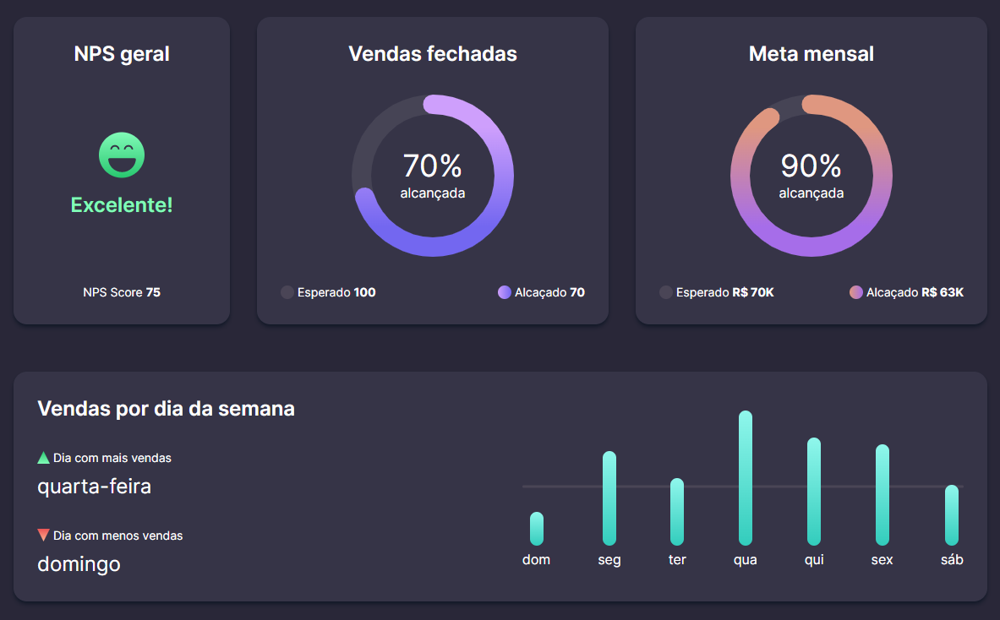

<h1 align="center">🚀Desafio 08 do projeto #boracodar da Rocktseat🚀</h1>

Este projeto consiste em desenvolver um dashboard responsivo conforme o modelo do [Figma](https://www.figma.com/community/file/1210217615683203825)

<h2>👩‍💻 Tecnologias</h2>
  
  
  
  
  
  

<h2>📱 Projeto</h2>

Neste projeto foi utilizado um arquivo "data.json" para simular uma API externa para capitação dos dados e a biblioteca Axios para fazer as requisições.

  

